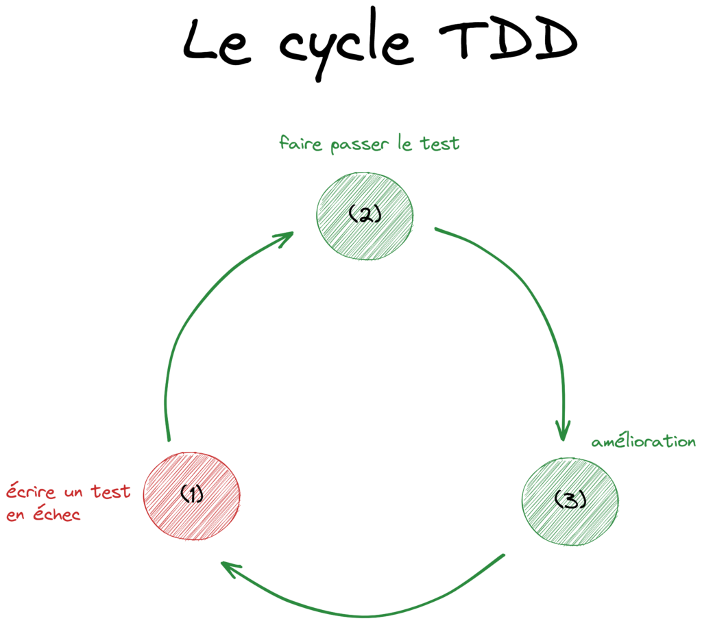

# 01 - Le Concept de TDD

## Objectif

À la fin de cette journée, vous devriez être en piloter vos développements par les tests unitaires.

## 1. Test-Driven Development (TDD)

Le **Test-Driven Development (TDD)**, ou développement piloté par les tests, est une approche de développement logiciel dans laquelle les tests unitaires sont écrits avant même que le code de production ne soit implémenté. Le processus TDD suit généralement ces étapes, souvent appelées "cycle de TDD" ou "cycle red-green-refactor" :

### Étape Rouge (Red)

Écrire un test unitaire qui échoue. Ce test unitaire doit représenter une fonctionnalité spécifique que vous souhaitez implémenter dans votre code.

### Étape Verte (Green)

Implémenter le code de production minimum nécessaire pour faire passer le test. L'objectif est de rendre le test unitaire réussi aussi rapidement que possible.

### Étape Refactor (Refactor)

Refactoriser le code pour améliorer sa qualité tout en maintenant la réussite du test unitaire. Cette étape vise à rendre le code plus lisible, maintenable et efficace sans changer son comportement fonctionnel.

### Répéter le Cycle

Répéter ces étapes pour chaque nouvelle fonctionnalité ou modification de code. Chaque nouvelle fonctionnalité commence par un test échouant, suivi de l'implémentation du code nécessaire pour réussir le test, puis d'un éventuel refactoring.




### Principaux avantages du TDD

- **Détection précoce des erreurs** : En écrivant des tests avant le code de production, les développeurs peuvent détecter les erreurs dès le début du processus de développement.
- **Conception incrémentale** : Le TDD favorise une approche de développement incrémentale, où le code est écrit et testé petit à petit, ce qui peut conduire à un code plus modulaire et à une conception plus réfléchie.
- **Confiance dans le code** : Avoir une suite complète de tests unitaires réussis donne aux développeurs la confiance nécessaire pour apporter des modifications au code sans craindre de casser d'autres parties du système.
- **Documentation vivante** : Les tests unitaires servent également de documentation pour le comportement attendu du code, ce qui facilite la maintenance et la collaboration entre les membres de l'équipe.

Le TDD est souvent associé à des pratiques agiles et est considéré comme une approche favorisant la qualité du code et la réactivité aux changements. Cependant, il peut nécessiter un certain temps pour s'habituer, et il est important que les tests soient pertinents et couvrent le comportement attendu du code.

## 2. Les tests unitaires

### 2.a. Importance des tests unitaires dans le développement logiciel

Les tests unitaires sont essentiels dans le développement logiciel pour plusieurs raisons :

- **Validation de la Logique Individuelle :** Les tests unitaires se concentrent sur des portions isolées du code (comme
  les fonctions ou les méthodes) pour s'assurer qu'elles fonctionnent comme prévu de manière indépendante.
- **Détection Précoce des Erreurs :** Ils aident à identifier les bugs et les problèmes dès le début du cycle de
  développement, ce qui simplifie les corrections et réduit les coûts de débogage.
- **Facilitation des Refactorisations :** Avec des tests unitaires fiables, les développeurs peuvent refactoriser le
  code avec la confiance que les modifications n'introduiront pas de nouveaux bugs.
- **Documentation du Code :** Les tests unitaires servent de documentation, expliquant comment le code est censé être
  utilisé et comment il se comporte dans différentes situations.
- **Assurance Qualité :** Ils fournissent une couche d'assurance qualité, garantissant que le code répond aux exigences
  et fonctionne de manière fiable.
- **Intégration Continue :** Dans les systèmes d'intégration continue, les tests unitaires sont exécutés automatiquement
  lors de chaque push, assurant que les nouvelles modifications n'affectent pas négativement l'application existante.

## 3. Installation et configuration de PHPUnit

### 3.a. Installation

Vous devez avoir une version de **PHP >= 7.4** et **composer >= 2**

On va installer **PHPUnit** qui est un framework de tests. Nous pouvons l'installer de manière globale, c'est-à-dire dans le dossier `/usr/local/bin` de notre machine ou alors, l'installer uniquement pour le projet en cours.

```bash
composer search phpunit
composer show phpunit/phpunit --all 

# Installation locale
composer require --dev phpunit/phpunit

# Installation globale
composer global require phpunit/phpunit
```

Plus d'information de comment installer [PHPUnit](https://docs.phpunit.de/en/10.5/installation.html#installation).

### 3.b. Configuration

1. Créez un dossier **src** et **tests** dans le dossier `01-le-concept-de-tdd/examples/message`.

2. Initialisez le projet ensuivant les instructions suivantes:

```bash
composer init
```

Dans le fichier `composer.json`, écrivez le code suivant, la classe `Message` sera dans le namespace `App` :

```json
{
    "name": "3wa/message",
    "autoload": {
        "psr-4": {
            "App\\Message\\": "src/"
        },
        "classmap": [
            "src/"
        ]
    },
    "authors": [
        {
            "name": "3WA",
            "email": "3wa@3wa.com"
        }
    ],
    "require": {}
}
```

à la racine du dossier `message` nous allons placer un fichier de configuration pour PHPUnit, créez le fichier `phpunit.xml.dist` et mettez le code suivant:

```xml
<?xml version="1.0" encoding="UTF-8"?>
<phpunit bootstrap="tests/bootstrap.php" colors="true">
    <testsuites>
        <testsuite name="Message">
            <directory>./tests</directory>
        </testsuite>
    </testsuites>
</phpunit>
```
Pour finir, on définit un fichier **bootstrap.php** de bootstrap à la racine du dossier `tests` avec le code suivant:

```php
<?php

require_once __DIR__ . '/../vendor/autoload.php';
```

3. Écrivons du code:

Créez le test suivant:

```php
<?php

use PHPUnit\Framework\TestCase;
use App\Message;

class MessageTest extends TestCase{

    protected Message $message;

    public function setUp():void{
        $this->message = new Message('en');
    }

    public function testOne()
    {
        $this->assertSame("Hello World!", $this->message->get());
    }
}
```

On vous donne la classe métier à tester :

```php
namespace App;

class Message
{
    public function __construct(
        private string $lang = 'en',  
        private array $transaltions = ['fr' => 'Bonjour les gens!', 'en' => 'Hello World!']
    )
    {
    }

    public function get(): string
    {
         return $this->transaltions[$this->lang];
    }

    public function setLang(string $lang): void
    {
        $this->lang = $lang;
    }
}
```

Lancez maintenant le test suivant en console à la racine du dossier `message`:

```bash
./vendor/bin/phpunit
```
> _Indication : si tous les tests sont bons alors, ils seront verts._

4. Exercice

Changez la langue dans un test supplémentaire et vérifiez que la classe pour la version fr renvoie bien `"Bonjour tout le monde!"`.
Si ce n'est pas le cas corriger le code métier pour faire passer le test.

## Analyser le Code Coverage avec PHPUnit

### Objectif

Mesurer la proportion du code source exécutée par les tests automatisés.

### Fonctionnement 

- **Instrumentation**: Ajout de points de suivi dans le code.
- **Exécution des Tests**: PHPUnit exécute les tests tout en collectant des données de couverture.
- **Rapports**: Génération de rapports indiquant quelles parties du code ont été testées.

### Types de Couverture

- **Ligne de Code (Line Coverage)**: Pourcentage de lignes exécutées.
- **Branches (Branch Coverage)**: Pourcentage de branches conditionnelles prises.
- **Path (Path Coverage)**: Pourcentage de chemins d'exécution différents.

### Utilisation

Exécutez PHPUnit avec l'option de couverture pour générer des rapports.

```bash
XDEBUG_MODE=coverage phpunit --coverage-html coverage --coverage-clover coverage/clover.xml
```
Visualisez les rapports HTML pour évaluer la qualité des tests et identifier les zones non testées.

- `--coverage-html`: Génère des rapports de couverture de code au format HTML pour visualiser la couverture du code via un navigateur.
- `--coverage-clover`: Génère des rapports de couverture de code au format Clover XML pour l'intégration avec des outils CI/CD ou de suivi de la qualité du code.

> ⚠️ Attention il faut installer un driver de coverage pour avoir cette fonctionnalité. Pour ce faire, nous pouvons [installer xDebug](https://xdebug.org/docs/install)

## Exercice 1: DotEnv

1. Installez la dépendance `DotEnv` et définissez à la racine du projet un fichier `.env` dans lequel vous définissez la variable d'environnement suivante:

```.env
LANGUAGE="fr"
```

> _Indication : dépôt de la dépendance qu'il faut installer : [https://github.com/vlucas/phpdotenv](https://github.com/vlucas/phpdotenv)_

2. Dans le `bootstrap.php` des tests importez les variables d'environnement.

3. Testez en fonction de la valeur `LANGUAGE` ou en le message de la méthode `get()` respectivement `"Hello World!"` ou `"Bonjour tout le monde!"`.

## Exercice 2: Calculator

Le but de cet exercice et de vous faire appréhender l'organisation des tests.

Dans la suite des tests on prendra comme précision 2 chiffres après la virgule.

Dans les questions 1 et 2 vous testerez uniquement la classe `Calculator`. Les classes dans le dossier `Model` seront testées à partir de la question 4.

1. Utilisez le code dans le dossier `exercice-02-calculator`. Installez le projet avec ces dépendances.

_Attention, `assertEquals` et `assertSame` sont différents. La deuxième méthode vérifie le type strictement._

2. Testez la classe `Calculator` en utilisant les concepts `DataProvider` (passer un tableau de valeurs) et d'exception décrit précédemment.

*Indications : vous devez tester le type des arguments et également les exceptions levées directement dans le code métier. Pensez à faire un `Trait` pour factoriser les providers.*

3. Testez maintenant le message renvoyé par l'exception.

```php
 $this->expectExceptionMessage('Impossible de diviser par zéro.');
```

*Dans la suite tous les résultats sont des entiers qui n'ont pas de partie décimale, voyez le type NumberString qui est retourné dans l'addition et la division.*

4. Testez maintenant la partie `Model` dans le dossier `src/`. Réorganisez le fichier XML de configuration des tests comme suit, n'utilisez pas de `DataProvider` pour cette partie vous testerez uniquement `add` et `divisor` comme dans les exemples ci-après.

```xml
<?xml version="1.0" encoding="UTF-8"?>
<phpunit bootstrap="tests/autoload.php"
         colors="true">
    <testsuites>
        <testsuite name="Calculator">
            <file>./tests/CalculatorTest.php</file>
        </testsuite>
         <testsuite name="Model">
           <directory>./tests/Model/ModelTest.php</directory>
        </testsuite>
    </testsuites>
</phpunit>
```

Faites les trois tests suivants :

- testez l'addition de deux nombres de type Number.

```php
public function testAdd()
{

}
```

- Testez la division de deux nombre de type Number.

```php
public function testDivisor()
{

}
```

- Testez l'exception division par zéro.

```php
public function testExceptionDivisor()
{

}
```

## Exercie 3: TP Fixtures parti 1/2

Lors de tests vous aurez besoin de fixtures (données d'exemple) pour tester des comportements. Nous allons découvrir cette notion. Récupérez dans le dossier Exercices l'exercice 03_Exercice_Model.

Remarques sur la méthode `setUp` dans ce TP, lisez les commentaires ci-dessous :

```php
public function setUp(): void
{
    // On utilise sqlite en mode vive
    $this->pdo = new \PDO('sqlite::memory:');
    $this->pdo->setAttribute(\PDO::ATTR_ERRMODE, \PDO::ERRMODE_EXCEPTION);

    $this->pdo->exec(
      "CREATE TABLE IF NOT EXISTS user
          (
            id INTEGER PRIMARY KEY AUTOINCREMENT,
            username VARCHAR( 225 ),
            createdAt DATETIME
          )
      "
    );
}
```

1. Hydratez les tests (fixtures) avec les données suivantes :

```php
$users = [
    ['username' => 'Alan'],
    ['username' => 'Sophie'],
    ['username' => 'Bernard'],
];
```

Remarque sur PDO vous pouvez demander à PDO de vous retourner les données sous forme d'un objet de type `User`` voyez le code dans ce cas :


- Dans la classe modèle

```php

namespace App;

class User {
    private string $username;
    private int $id;

    public function __set($name, string $value): void
    {
        $this->$name = $value;
    }

    public function __get(string $name): string
    {
        return $this->$name;
    }
}
```

- Dans le modèle et la méthode `fetchAll`

```php
public function all()
{
    $stmt = $this->pdo->query("SELECT * FROM user");

    return $stmt->fetchAll(\PDO::FETCH_CLASS, 'App\\User');
}
```

2. Faites les tests décrit dans le fichier `UserTest`.

3. Créez le `ModelPrepare` qui s'occupera de sécuriser les requêtes en les préparant.

## Exercie 3: TP Fixtures parti 2/2

Nous allons maintenant utiliser un composant pour automatiser l'import des données afin de faire des tests avec une données mieux organiser.

Modifiez le modèle en conséquence des données d'exemple dans cette partie de l'exercice.

Installez la dépendance suivante :

```bash
composer require symfony/yaml --dev
```

Récupérez le dossier `_data` dans le dossier `examples` et le mettre dans le dossier `tests`. À l'aide du code ci-dessous importez ces données d'exemple dans une autre classe de test `UserYamlTest`. Vous testerez les mêmes méthodes (ne changez pas le code des méthodes de tests).

```php
use Symfony\Component\Yaml\Parser;

$yaml = new Parser();
$users = $yaml->parse(file_get_contents(__DIR__.'/_data/seed.yml'));
```

> _Remarque : les seeds YAML sont légers et pratiques, couplés avec des bases de données en mémoire pour tester qu'une partie de la logique des modèles est performant._

## Exercice 4: Suite de Fibonacci TDD

### Partie 1

Créez une classe de tests vérifiant l'algorithmique de la [suite de Fibonacci](https://fr.wikipedia.org/wiki/Suite_de_Fibonacci) dans une classe, vous devez écrire les tests avant d'implémenter la logique métier de la classe. Une fois un test ou les tests réalisés vous devez vérifier qu'il(s) soi(ent) valide en implémentant le code métier du/des test(s).

Organisez le projet de manière conforme aux recommandations des standards PHP.

### Partie 2

Une manière d'optimiser l'empreinte mémoire d'un script est l'utilisation des générateurs. Un générateur est itérable et une fois itéré ne peut plus l'être pour une instance de générateur donné.

Refactorez dans une autre classe en utilisant l'approche des générateurs et testez à l'aide du principe TDD.

Un générateur est une fonction ou méthode ayant le mot clé yield.

```php
function gen() {
    yield 1;
    yield 2;
    yield 3;
}

// création d'une instance 
$gen = gen(); 

foreach($gen as $num) echo $num; // 1, 2, 3

// Si on ré-itère sur le générateur il est cette fois vide
foreach($gen as $num) echo $num; // aucune valeur
```

Une autre idée de générateur 

```php

function genWhile($max = 10){
    while($max > 0) {
        yield $max;
        $max--;
    }
}

```

## Nombre narcissique

Un nombre narcissique est un nombre qui s'écrit comme suit :

```php
153 = 1**3 + 5**3 + 3**3;
```

où la puissance 3 désigne la puissance de 10 du nombre : 3 chiffres == 10**3.

Ecrire un test qui teste si on a un nombre narcissique, utilisez le principe TDD.

## Allons plus loin encore: Les Mocks

# Mock ou doublure

Un Mock est une **doublure**, c'est un objet créé à partir d'une classe dont vous connaissez le fonctionnent.

Vous utiliserez cette technique pour tester l'algorithmique d'une classe qui consomme un autre objet que l'on ne teste pas soit parce qu'il n'est plus à tester, soit parce que vous tester le comportement d'une classe donnée. Les tests doivent être le plus possible Single Responsability. Vous devez uniquement tester le comportement d'une classe donnée, une classe possède des responsabilités limités et bien définies, principe SOLID, Single Responsability.

## Un peu de vocabulaire.

- Un **dummy** est un objet qui remplit un contrat sans autre précision.

```php
$mockStorage = $this->createMock(Storable::class);
```

- Un **stub** est un **dummy** auquel on a défini un comportement pour certaine(s) méthode(s) et indiquez ce que cette méthode doit retourner.

```php
$mockStorage = $this->createMock(Storable::class);
$mockStorage->method('getStorage')->willReturn(['apple' => round(10 * 1.5 * 1.2, 2)]);
```

Et **Stub** peut également retourner un dummy. Imaginons que la méthode getValue retourne un objet de type Product :

```php
$product = $this->createMock(Product::class);
$mockStorage->method('getValue')->willReturn($product);
```

- Un mock est une doublure qui définit ses comportements ou attentes en anglais. Ainsi chaque méthode du Mock possède un comportement spécifique ou définit :

```php
$mockStorage->expects($this->once())->method('setValue')->with($apple->getName(), abs(1.5 * 10 * 1.2));
```

- **Mock** définition :

**La pratique consistant à remplacer un objet avec une doublure de test qui vérifie des attentes, par exemple en faisant l’assertion qu’une méthode a été appelée, est appelée mock.**

## Utiliser une doublure dans les tests 

Vous pouvez par exemple tester que le Mock renvoi bien l'objet Mock lui-même de la manière suivante :

```php
// Créer un bouchon pour la classe de type Storable (interface).
$mockStorage = $this->createMock(Storable::class);

// Configurer le bouchon la méthode get retournera l'objet $mockStorage lui-même
$mockStorage->method('get')
        ->will($this->returnSelf());

$this->assertSame($mockStorage, $mockStorage->get());
```

Un Mock peut également lever une exception que l'on pourra par la suite tester.

```php
use PHPUnit\Framework\TestCase;

class CartTest extends TestCase
{
    public function testException(){
        // stub si on définit uniquement un comportement
        $stub = $this->createMock(Storable::class);

        $stub->method('getStorage')
             ->will($this->throwException(new \InvalidArgumentException));

        $stub->getStorage();
        $this->expectException(InvalidArgumentException::class);
    }
}
```

## Utilisation d'un Mock 

Le storage ci-dessous est un Mock au sens où l'on attent un comportement spécifique que l'on a définit dans le Mock et que l'on teste lors de l'appel d'une méthode buy dans la classe Cart qui consomme cet objet.

```php
use PHPUnit\Framework\TestCase;

class CartTest extends TestCase
{
    public function testCallResetWhenBuyMethodStorage()
    {
        $apple = new Product('apple', 1.5);
        $mockStorage = $this->createMock(Storable::class);
        $cart =  new Cart($mockStorage);
        $mockStorage
             ->expects($this->once())
             ->method('setValue')
             ->with($apple->getName(), abs(1.5 * 10 * 1.2));

        $cart->buy($apple, 10);
    }
}
```
